# Энэ гарын авлагын тухай

Энэхүү баримт нь **WinFit админ самбарын** (`dashboard`) бүх дэлгэцийг зурагтайгаар
тайлбарлаж, өдөр тутмын үйлдлүүдийг алхам алхмаар харуулна.

Уншигч: **ресепшн ажилтан, менежер, админ**. Техникийн мэдлэг шаардахгүй.

> **Эх файл:** `dashboard/docs/admin-guide/README.md`
> **PDF үүсгэх:** `dashboard/docs/admin-guide/build.sh` эсвэл `npm run docs:pdf`
>
> Гарын авлагыг өөрчлөх шаардлага гарвал Markdown эх файлыг засаад дээрх
> тушаалыг ажиллуулахад PDF дахин үүснэ. Зургуудыг `img/` хавтсанд хадгална.

**Зургийн тухай:** энэ гарын авлагын бүх зураг нь **туршилтын өгөгдөл** дээр
авагдсан (demo горим). Тоо, нэрс нь бодит биш.

---

# 1. Эхлэл

## 1.1 Нэвтрэх

Хөтөч дээр админ самбарын хаяг **`https://admin.winfit.mn`**-г нээнэ.
Нэвтрэх дэлгэц дээр:

| Талбар | Тайлбар |
|---|---|
| **И-мэйл** | Админаас өгсөн ажлын и-мэйл хаяг |
| **Нууц үг** | Анх удаа — админаас амаар дамжуулсан **түр нууц үг** |

> ⚠ **`winfit.mn` ба `admin.winfit.mn` хоёр нь ӨӨР сайт.**
>
> | Хаяг | Хэнд зориулагдсан |
> |---|---|
> | **`admin.winfit.mn`** | **Ажилтны админ самбар** — энэ гарын авлага үүнийг тайлбарлана |
> | `winfit.mn` | Гишүүдийн нийтийн сайт — багцын мэдээлэл, `/pay` төлбөрийн хуудас |
> | `api.winfit.mn` | Сервер (хүн шууд нэвтрэхгүй) |

* Анхны нэвтрэлтэд систем **нууц үг солихыг албадана** (`/change-password`).
  Хамгийн багадаа **8 тэмдэгт** байна.
* Нууц үгээ мартвал **«Нууц үг мартсан»** дарж хүсэлт үлдээнэ. Систем и-мэйл
  илгээхгүй — хүсэлт **админы дэлгэц дээр** гарч ирэх бөгөөд админ шинэ түр
  нууц үг өгнө.
* Нэвтрэлт **токеноор** ажилладаг. Нууц үг солиход **бүх төхөөрөмж дээрх сесс
  тасарч**, дахин нэвтрэх шаардлагатай болно.

## 1.2 Дэлгэцийн бүтэц

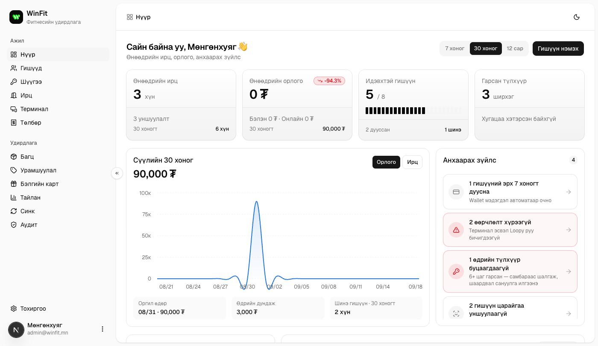

Бүх дэлгэц гурван хэсэгтэй:

1. **Зүүн цэс** — хоёр бүлэгт хуваагдана:
   * **Ажил** — өдөр тутам хэрэглэдэг: Нүүр, Гишүүд, Шүүгээ, Ирц, Терминал, Төлбөр.
   * **Удирдлага** — тохируулга, хяналт: Багц, Урамшуулал, Бэлгийн карт, Тайлан,
     Синк, Аудит.
   * Доод талд **Тохиргоо** ба нэвтэрсэн хэрэглэгчийн нэр.
   * Цэсний ирмэг дэх **«**«**»** товчоор цэсийг нарийсгаж дэлгэц чөлөөлнө.
2. **Дээд мөр** — байршил заасан *breadcrumb* (Нүүр › Гишүүд › Дэлгэрэнгүй) ба
   баруун талд **өдөр/шөнийн горим** солих товч.
3. **Агуулга** — тухайн дэлгэцийн үндсэн хэсэг.

> **Эрхээс хамаарч цэс өөрчлөгдөнө.** Ресепшн ажилтанд Тохиргоо, Урамшуулал
> зэрэг зарим цэс харагдахгүй.

---

# 2. Эрхийн систем

WinFit-д **гурван эрх** байна. Эрх нь **шатлалтай** — дээд эрх доод эрхийн бүх
үйлдлийг хийж чадна.

```
Ресепшн  <  Менежер  <  Админ
```

| Үйлдэл | Ресепшн | Менежер | Админ |
|---|:--:|:--:|:--:|
| Гишүүн харах, хайх | ✅ | ✅ | ✅ |
| Шинэ гишүүн бүртгэх, засах | ✅ | ✅ | ✅ |
| Ирц харах, CSV татах | ✅ | ✅ | ✅ |
| Шүүгээ олгох, буцаах | ✅ | ✅ | ✅ |
| Шүүгээний тохируулга (өрөө, үнэ) | ❌ | ✅ | ✅ |
| **Эрх сунгах (бэлнээр)** | ⚠️ тохиргооноос | ✅ | ✅ |
| Түр зогсоох / сэргээх / цуцлах | ❌ | ✅ | ✅ |
| Худалдан авалт **буцаах** | ❌ | ✅ | ✅ |
| Чөлөө олгох | ❌ | ✅ | ✅ |
| Бэлгийн карт үүсгэх, цуцлах | ❌ | ✅ | ✅ |
| Бэлгийн карт **«Ашигласан»** гэж тэмдэглэх | ✅ | ✅ | ✅ |
| Багц нэмэх, засах, идэвхгүй болгох | ❌ | ✅ | ✅ |
| Терминал шинэчлэх, хаалга нээх, дахин бичих | ❌ | ✅ | ✅ |
| Аудит, Синк үзэх | ❌ | ✅ | ✅ |
| **Урамшуулал** үүсгэх, засах, устгах | ❌ | ❌ | ✅ |
| **Тохиргоо** (бүх хуудас) | ❌ | ❌ | ✅ |
| **Ажилтан** нэмэх, эрх солих | ❌ | ❌ | ✅ |
| Loopy программ сонгох, тулгах | ❌ | ❌ | ✅ |
| Мэдэгдэл (мэйл) тохируулах | ❌ | ❌ | ✅ |
| Терминалын холболт тохируулах | ❌ | ❌ | ✅ |

⚠️ **Ресепшн бэлнээр эрх сунгах** нь `Тохиргоо → Ажилтны эрх` дэх тохируулгаас
хамаарна. Унтраалттай үед зөвхөн менежер ба админ сунгана
(§5.3-ыг үзнэ үү).

> **Бүх мөнгөтэй холбоотой үйлдэл аудитад бичигдэнэ** — хэн, хэзээ, ямар
> шалтгаанаар гэдэг үлдэнэ (§4.15).

---

# 3. Үйл ажиллагааны урсгал

## 3.1 Шинэ гишүүн бүртгэх — бүрэн зураглал

Энэ бол хамгийн түгээмэл асуулт: *«Шинэ гишүүн бүртгэхэд яг ямар үйлдэл хийх вэ?»*

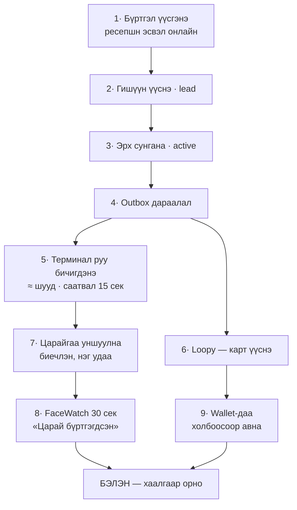
```mermaid
flowchart TD
    A["1· Бүртгэл үүсгэнэ<br/>ресепшн эсвэл онлайн"] --> B["2· Гишүүн үүснэ · lead"]
    B --> C["3· Эрх сунгана · active"]
    C --> D["4· Outbox дараалал"]
    D --> E["5· Терминал руу бичигдэнэ<br/>≈ шууд · саатвал 15 сек"]
    D --> F["6· Loopy — карт үүснэ"]
    E --> G["7· Царайгаа уншуулна<br/>биечлэн, нэг удаа"]
    G --> H["8· FaceWatch 30 сек<br/>«Царай бүртгэгдсэн»"]
    F --> I["9· Wallet-даа<br/>холбоосоор авна"]
    H --> J["БЭЛЭН — хаалгаар орно"]
    I --> J
```

**Алхам бүрийн хугацаа:**

| Алхам | Хэдий хугацаанд | Тайлбар |
|---|---|---|
| Бүртгэл → Outbox | шууд | Бүртгэх товч дарсан агшинд |
| Outbox → Терминал | **≈ шууд** | Дохиогоор сэрээнэ. Сэрээлт хүрэхгүй бол **15 секунд** тутмын тандалт барина |
| Алдаа гарвал дахин оролдлого | **1 мин → 5 мин → 30 мин → 2 цаг → 6 цаг** | 5 удаа. Дараа нь «Бүтэлгүйтсэн» болж Синк дээр улаанаар гарна |
| Царай уншуулсан → WinFit мэдэх | **30 секунд хүртэл** | `FaceWatch` тандалт |
| Wallet карт | шууд | Loopy-д дугаар нэмэгдэнэ, гишүүн өөрөө холбоосоор авна |

> **Чухал:** Терминал дээр хүний *бүртгэл* л автоматаар үүснэ. **Царайг нь
> терминал дээр биечлэн нэг удаа уншуулах** шаардлагатай — үүнийг сервер хийж
> чадахгүй. Уншуулсны дараа WinFit өөрөө мэдэж авна, ажилтан юу ч хийхгүй.

## 3.2 Онлайн бүртгэл ба төлбөр (`winfit.mn/pay`)

Гишүүн ресепшн дээр ирэлгүй, өөрөө вэбээр бүртгүүлж төлж болно.

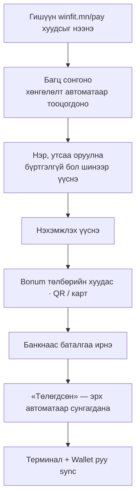
```mermaid
flowchart TD
    A["Гишүүн winfit.mn/pay хуудсыг нээнэ"] --> B["Багц сонгоно<br/>хөнгөлөлт автоматаар тооцогдоно"]
    B --> C["Нэр, утсаа оруулна<br/>бүртгэлгүй бол шинээр үүснэ"]
    C --> D["Нэхэмжлэх үүснэ"]
    D --> E["Bonum төлбөрийн хуудас · QR / карт"]
    E --> F["Банкнаас баталгаа ирнэ"]
    F --> G["«Төлөгдсөн» — эрх автоматаар сунгагдана"]
    G --> H["Терминал + Wallet руу sync"]
```

* Зөвхөн **`online` тэмдэгтэй, 1 хүний** багц онлайнаар зарагдана. Хосын багц,
  гэр бүлийн багц зэрэг нь landing дээр **харагдана** ч төлбөрийг ресепшн дээр
  авна.
* Төлөгдөөгүй нэхэмжлэх нь **30 секунд тутам** шалгагдаж, хугацаа хэтэрвэл
  автоматаар хаагдана.
* Онлайнаар сунгасан эрх **Аудитад бичигдэхгүй** — Аудит нь зөвхөн *гараар*
  хийсэн үйлдлийг харуулдаг (§4.15).

## 3.3 Гишүүний төлөвийн мөчлөг

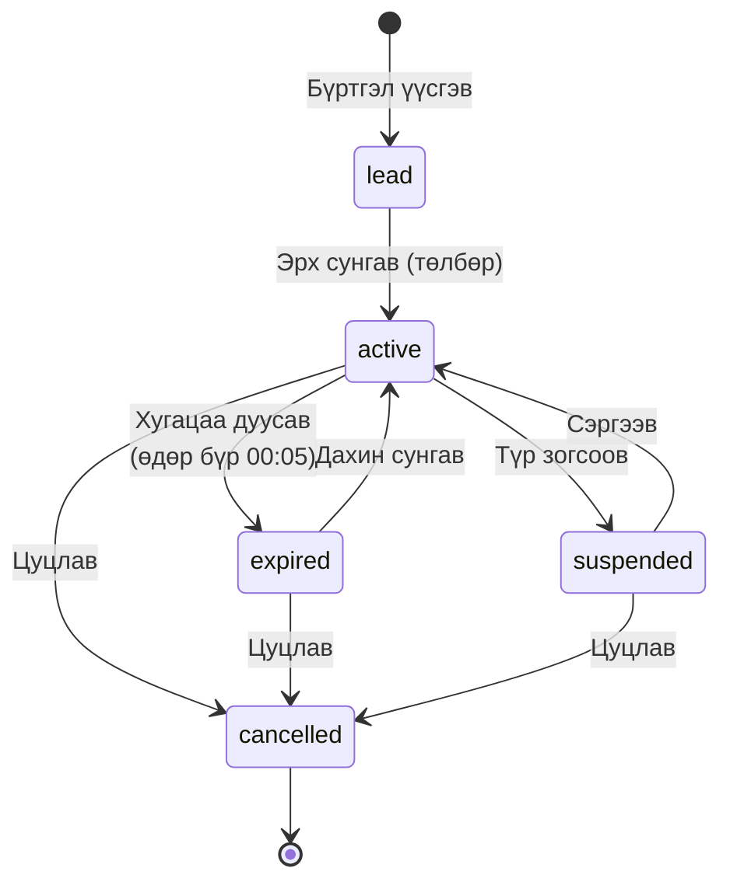
```mermaid
stateDiagram-v2
    [*] --> lead: Бүртгэл үүсгэв
    lead --> active: Эрх сунгав (төлбөр)
    active --> expired: Хугацаа дуусав<br/>(өдөр бүр 00:05)
    expired --> active: Дахин сунгав
    active --> suspended: Түр зогсоов
    suspended --> active: Сэргээв
    active --> cancelled: Цуцлав
    expired --> cancelled: Цуцлав
    suspended --> cancelled: Цуцлав
    cancelled --> [*]
```

| Төлөв | Утга | Терминал дээр |
|---|---|---|
| **Шинэ** (`lead`) | Бүртгэгдсэн, төлбөр хийгээгүй | Эрхгүй |
| **Идэвхтэй** (`active`) | Хүчинтэй эрхтэй | Нэвтэрнэ |
| **Хугацаа дуссан** (`expired`) | Хугацаа өнгөрсөн | **Устахгүй** — сунгамагц царай нь хэвээр ажиллана |
| **Түр зогссон** (`suspended`) | Түр хаалттай | Бүртгэл үлдэнэ, эрх унтарна |
| **Цуцлагдсан** (`cancelled`) | Бүрмөсөн гарсан | **Терминалаас устана (царай хамт)** |

> **«Цуцлах» нь эргэн сэргээхэд хамгийн хүндрэлтэй үйлдэл** — царай нь
> терминалаас устах тул хүн дахин ирвэл дахин уншуулах шаардлагатай.
> Түр завсарлах бол **«Түр зогсоох»** эсвэл **«Чөлөө»**-г ашиглана.

## 3.4 Өдөр тутмын автомат ажил

Систем дараах ажлыг **өөрөө** гүйцэтгэнэ (цагийн бүс: Улаанбаатар).

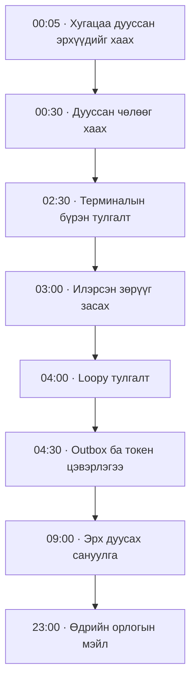
```mermaid
flowchart TD
    T1["00:05 · Хугацаа дууссан эрхүүдийг хаах"] --> T2["00:30 · Дууссан чөлөөг хаах"]
    T2 --> T3["02:30 · Терминалын бүрэн тулгалт"]
    T3 --> T4["03:00 · Илэрсэн зөрүүг засах"]
    T4 --> T5["04:00 · Loopy тулгалт"]
    T5 --> T6["04:30 · Outbox ба токен цэвэрлэгээ"]
    T6 --> T7["09:00 · Эрх дуусах сануулга"]
    T7 --> T8["23:00 · Өдрийн орлогын мэйл"]
```

| Цаг | Ажил | Юу болох вэ |
|---|---|---|
| **00:05** | Эрх дуусгах | Хугацаа өнгөрсөн `active` гишүүд `expired` болно |
| **00:30** | Чөлөө дуусгах | Хугацаа нь дууссан чөлөөнүүд хаагдаж эрх сэргэнэ |
| **02:30** | Терминал тулгалт | Терминал дээрх хэрэглэгчдийг WinFit-тэй харьцуулж зөрүү бүртгэнэ |
| **03:00** | Терминал зөрүү засах | Илэрсэн зөрүүг автоматаар засна |
| **04:00** | Loopy тулгалт | Wallet карт, зөвшөөрөгдсөн дугаарын жагсаалтыг тулгана |
| **04:30 / 04:40** | Цэвэрлэгээ | Хуучин Outbox бичлэг, хугацаа дууссан токен устана |
| **09:00** | Сануулга | Эрх дуусах гэж буй гишүүдэд Wallet мэдэгдэл явна |
| **23:00** | Мэйл | Өдрийн орлогын хураангуй админы мэйлд явна |
| **тасралтгүй** | Outbox | 15 сек тутам, дохио ирвэл шууд |
| **тасралтгүй** | FaceWatch | 30 сек тутам — шинэ царай бүртгэгдсэн эсэхийг шалгана |
| **тасралтгүй** | Нэхэмжлэх | 30 сек тутам — хугацаа хэтэрсэн нэхэмжлэх хаана |

---

# 4. Дэлгэц бүрийн тайлбар

## 4.1 Нүүр


Өдөр эхлэхэд хамгийн түрүүнд харах дэлгэц.

**Дээд талын 4 карт:**

| Карт | Юу харуулах вэ |
|---|---|
| **Өнөөдрийн ирц** | Өнөөдөр хэдэн **хүн** орсон (давхардалгүй). Доор нь нийт уншуулалт ба сонгосон хугацааны дүн |
| **Өнөөдрийн орлого** | Өнөөдрийн нийт орлого. Хажууд нь өмнөх үетэй харьцуулсан **хувь** (улаан = буурсан). Бэлэн ба онлайн гэж задарна |
| **Идэвхтэй гишүүн** | Хүчинтэй эрхтэй / нийт гишүүн. Доор нь тухайн хугацаанд дууссан ба шинээр нэмэгдсэн тоо |
| **Гарсан түлхүүр** | Одоо гишүүдийн гарт байгаа шүүгээний түлхүүрийн тоо, хугацаа хэтэрсэн эсэх |

**Хугацааны шүүлтүүр** (баруун дээд): `7 хоног` · `30 хоног` · `12 сар` — бүх
картыг нэг дор шинэчилнэ.

**Графикийн хэсэг:** Орлого / Ирц гэж сольж харна. Доор нь оргил өдөр, өдрийн
дундаж, шинэ гишүүдийн тоо.

**«Анхаарах зүйлс» жагсаалт** (баруун тал) — **энэ бол ажлын жагсаалт**.
Улаанаар тэмдэглэгдсэн зүйл бол **яг одоо арга хэмжээ авах** шаардлагатай:

| Мөр | Утга | Юу хийх вэ |
|---|---|---|
| «N гишүүний эрх N хоногт дуусна» | Сануулга автоматаар явна | Мэдээллийн зорилготой |
| **«N өөрчлөлт хүрээгүй»** | Терминал/Loopy руу бичигдээгүй | **Синк** хуудсанд орж шалтгааныг харна (§4.14) |
| **«N өдрийн түлхүүр буцаагдаагүй»** | 6+ цаг гарсан түлхүүр | Шүүгээний самбараас шалгана (§4.6) |
| «N гишүүн царайгаа уншуулаагүй» | Терминал дээр царай бүртгэгдээгүй | Гишүүнд сануулж, терминал дээр уншуулна |

Мөр бүрийг дарвал холбогдох дэлгэц рүү шууд шилжинэ.

**«Гишүүн нэмэх»** товч — шинэ бүртгэлийн формыг нээнэ.

---

## 4.2 Гишүүд

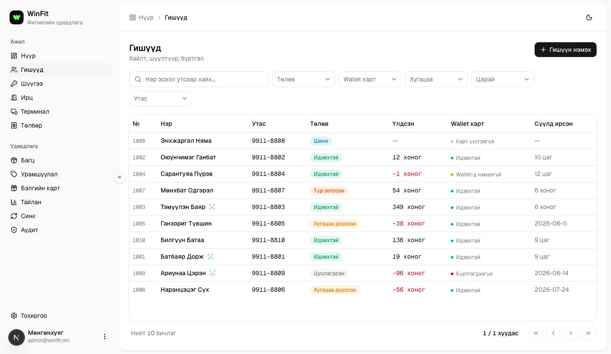

Бүх гишүүний жагсаалт, хайлт, шүүлтүүр.

**Хайлт:** нэр эсвэл утасны дугаараар. Бичиж эхэлмэгц шүүнэ.

**Шүүлтүүрүүд:**

| Шүүлтүүр | Сонголтууд |
|---|---|
| **Төлөв** | Шинэ · Идэвхтэй · Хугацаа дуссан · Түр зогссон · Цуцлагдсан |
| **Wallet карт** | Идэвхтэй · Wallet-д нэмээгүй · Карт үүсгээгүй · Бүртгэгдээгүй |
| **Хугацаа** | Удахгүй дуусах · Дууссан г.м. |
| **Царай** | Бүртгэгдсэн · Бүртгэгдээгүй |
| **Утас** | Дугаартай · Дугааргүй |

**Хүснэгтийн баганууд:**

* **№** — гишүүний дугаар. Энэ дугаараар л терминал гишүүнийг таньдаг.
* **Нэр** — хажууд нь 🙂 дүрс байвал **царай бүртгэгдсэн** гэсэн үг.
* **Төлөв** — өнгөт шошго.
* **Үлдсэн** — эрх дуусахад үлдсэн хоног. **Сөрөг тоо = хугацаа хэтэрсэн**.
* **Wallet карт** — өнгөт цэг: ногоон = идэвхтэй, шар = Wallet-д нэмээгүй,
  улаан = бүртгэгдээгүй.
* **Сүүлд ирсэн** — хамгийн сүүлд уншуулсан хугацаа.

Мөрийг дарвал **дэлгэрэнгүй** хуудас нээгдэнэ.

### Ажлын зөвлөмж

> «Wallet-д нэмээгүй» шүүлтүүр нь **сануулга хүрэхгүй** байгаа гишүүдийг олох
> хамгийн хурдан арга. Эдгээр хүн Wallet-даа картаа аваагүй тул эрх дуусах
> мэдэгдэл очихгүй — гараар залгах хэрэгтэй.

---

## 4.3 Шинэ гишүүн бүртгэх

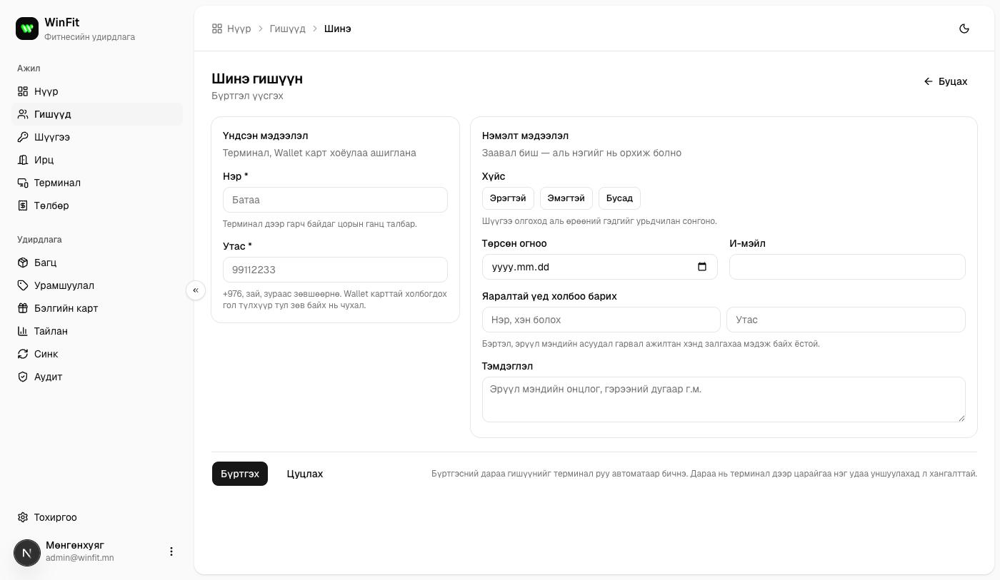

`Гишүүд → Гишүүн нэмэх` эсвэл Нүүр дээрх товч.

### Үндсэн мэдээлэл (заавал)

| Талбар | Тайлбар | Яагаад чухал вэ |
|---|---|---|
| **Нэр** \* | Бүтэн нэр | **Терминал дээр гарч ирэх цорын ганц талбар**. Товчлолгүй, зөв бичнэ |
| **Утас** \* | 8 оронтой (+976, зай, зураас зөвшөөрнө) | **Wallet карттай холбогдох гол түлхүүр**. Буруу бол карт үүсэхгүй |

### Нэмэлт мэдээлэл (заавал биш)

| Талбар | Тайлбар |
|---|---|
| **Хүйс** | Эрэгтэй · Эмэгтэй · Бусад. Шүүгээ олгоход **аль өрөөний** гэдгийг урьдчилан сонгоно |
| **Төрсөн огноо** | Насны тайлан, хөнгөлөлтөд ашиглана |
| **И-мэйл** | Баримт илгээхэд |
| **Яаралтай үед холбоо барих** | Нэр + утас. Бэртэл, эрүүл мэндийн асуудал гарвал залгах хүн |
| **Тэмдэглэл** | Эрүүл мэндийн онцлог, гэрээний дугаар г.м. |

**«Бүртгэх»** дарсны дараа:

1. Гишүүн **«Шинэ»** төлөвтэй үүснэ — **хараахан хаалгаар орохгүй**.
2. Терминал руу автоматаар бичигдэнэ (§3.1).
3. Дараа нь **эрх сунгах** шаардлагатай (§4.4).

> ⚠️ Утасны дугаар нь **давхардаж болохгүй**. Ижил дугаартай гишүүн байвал
> систем алдаа өгнө — шинээр үүсгэхийн оронд байгаа бүртгэлийг нь сунгана.

---

## 4.4 Гишүүний дэлгэрэнгүй

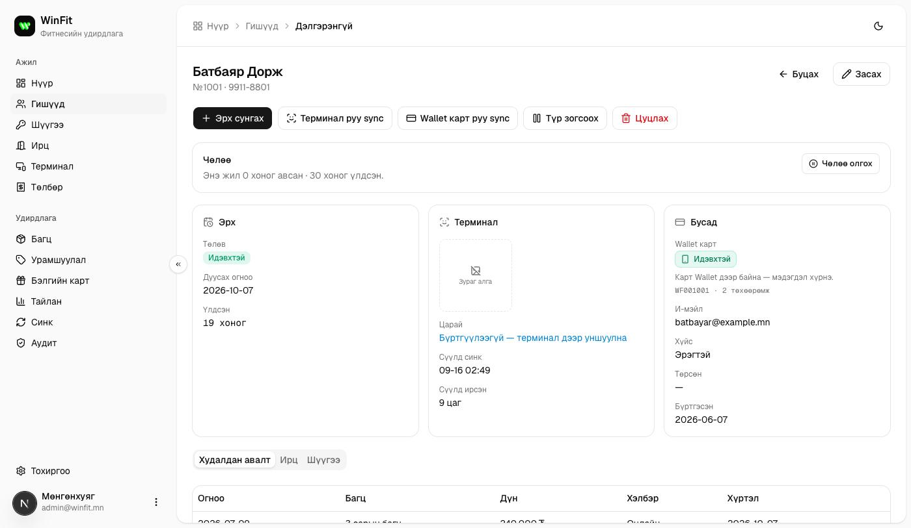

Гишүүнтэй холбоотой **бүх** зүйл энд төвлөрнө.

### Дээд талын үйлдлүүд

| Товч | Хэн | Юу болох вэ |
|---|---|---|
| **Эрх сунгах** | Менежер+ (тохиргоотой бол ресепшн) | Багц сонгож төлбөр бүртгэнэ → §4.4.1 |
| **Терминал руу sync** | Менежер+ | Гар аргаар дахин бичих. Терминал дээр гишүүн байхгүй болсон үед |
| **Wallet карт руу sync** | Менежер+ | Loopy руу дахин илгээх |
| **Түр зогсоох** | Менежер+ | Эрх унтарна, бүртгэл үлдэнэ. Шалтгаан заавал бичнэ |
| **Цуцлах** (улаан) | Менежер+ | **Терминалаас устгана — царай хамт** |
| **Засах** | Бүгд | Нэр, утас, нэмэлт мэдээлэл |
| **Чөлөө олгох** | Менежер+ | Эрхийн хугацааг зогсоож, дараа нь нөхөж олгоно |

### Гурван мэдээллийн карт

**1. Эрх**

* Төлөв, **дуусах огноо**, үлдсэн хоног.
* Сөрөг тоо = хэтэрсэн.

**2. Терминал**

* **Царайны зураг** — терминалаас шууд татагдана. Байхгүй бол «Зураг алга»
  гэсэн тэмдэг гарна. Зураг дээр дарвал **томруулж** харна.
* **Царай** — «Бүртгэгдсэн» эсвэл «Бүртгүүлээгүй — терминал дээр уншуулна».
* **Сүүлд синк** — хамгийн сүүлд терминал руу бичигдсэн цаг.
* **Сүүлд ирсэн** — хамгийн сүүлд уншуулсан.

> **Зураг татагдахгүй байх нь хэвийн.** Терминалын санах ой дүүрэхэд хуучин
> зураг дарагддаг. Мөн серверээс терминал руу хүрэхгүй үед ч харагдахгүй.
> WinFit өгөгдлийн санд **зургийг хадгалдаггүй** — зөвхөн замыг нь хадгалж,
> хэрэгтэй үед терминалаас татдаг (сан томроохгүйн тулд).

**3. Бусад**

* **Wallet карт** төлөв, картын дугаар (`WF001001`), хэдэн төхөөрөмж дээр
  нэмэгдсэн.
* И-мэйл, хүйс, төрсөн огноо, бүртгүүлсэн огноо.

### Доод талын хавтаснууд

| Хавтас | Агуулга |
|---|---|
| **Худалдан авалт** | Огноо, багц, дүн, хэлбэр (бэлэн/онлайн/бэлэг), хүртэл огноо. Менежер мөр бүрийг **буцаах** боломжтой |
| **Ирц** | Уншуулалт бүрийн цаг, үр дүн, кадрын зураг |
| **Шүүгээ** | Түүх — хэзээ ямар шүүгээ авч, хэзээ буцаасан |

### 4.4.1 Эрх сунгах цонх

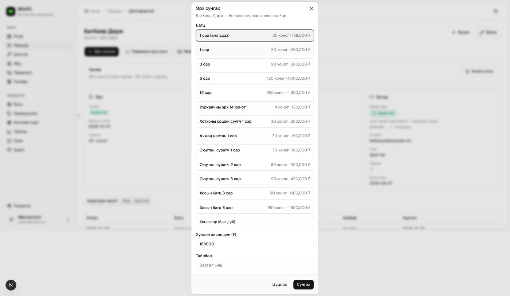

1. **Багц** жагсаалтаас сонгоно. Хажууд нь **хоног · үнэ** харагдана.
   * «Хоногоор (багцгүй)» — тусгай тохиолдолд хоногоор гараар өгнө.
2. **Хүлээн авсан дүн** — багцын үнэ автоматаар бөглөгдөнө. Хөнгөлөлт,
   дугуйруулалт хийвэл гараар өөрчилнө.
3. **Тайлбар** — заавал биш, гэхдээ **хямдруулсан бол яагаад гэдгийг бичнэ**.
   Энэ бичвэр Аудитад үлдэнэ.
4. **«Сунгах»**.

**Сунгасны дараа:**

* Гишүүн `active` болно. Дуусах огноо нь:
  * Эрх нь **идэвхтэй** байсан бол → хуучин дуусах огноо дээр нэмнэ.
  * **Дууссан** байсан бол → өнөөдрөөс тоолно.
* Терминал ба Wallet руу автоматаар sync хийгдэнэ.
* Аудитад бичигдэнэ.

> **Хөнгөлөлт:** идэвхтэй урамшуулал байвал онлайн болон landing дээр
> автоматаар тооцогдоно (§4.11). Ресепшн дээр гараар сунгахад дүнг өөрөө
> тохируулна.

### 4.4.2 Гишүүн «устгах»

WinFit-д гишүүнийг **бүрмөсөн устгадаггүй** — санхүүгийн түүх, ирцийн бүртгэл
алдагдах тул. Оронд нь:

| Хэрэгцээ | Хийх үйлдэл | Эргээд сэргэх үү |
|---|---|---|
| Хэдэн сар завсарлана | **Чөлөө олгох** | ✅ Хугацаа нь нөхөгдөнө |
| Тодорхойгүй хугацаагаар зогсоох | **Түр зогсоох** | ✅ «Сэргээх» дарахад шууд |
| Бүрмөсөн гарсан | **Цуцлах** | ⚠️ Бүртгэл үлдэнэ, гэхдээ **царайг дахин уншуулна** |
| Буруу бүртгэсэн, давхардсан | **Цуцлах** + тэмдэглэлд шалтгаан бичих | — |

---

## 4.5 Гишүүн засах

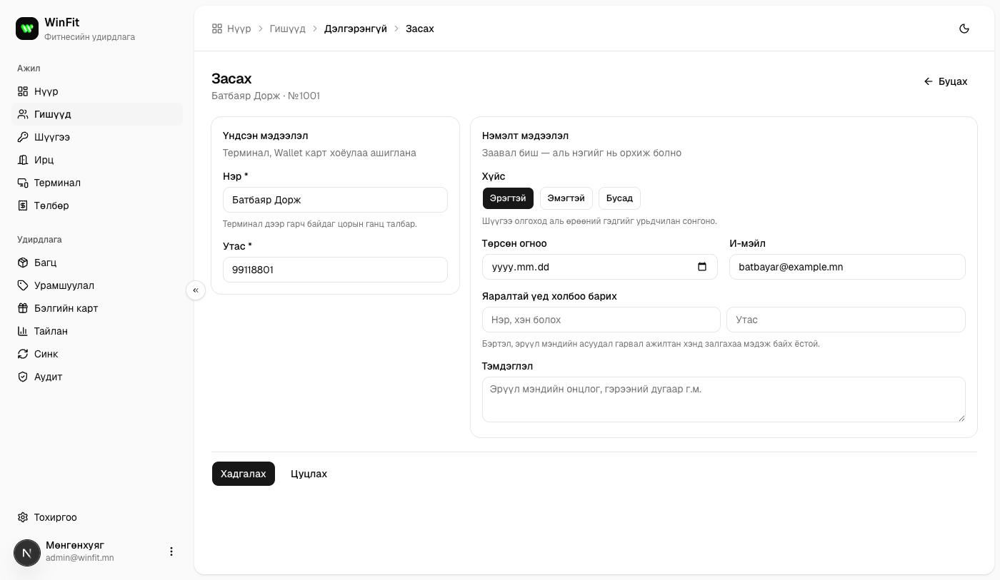

Бүртгэлийн формтой ижил. Зөвхөн **нэр, утас, нэмэлт мэдээлэл** өөрчлөгдөнө.

> **Нэр эсвэл утас өөрчлөхөд** систем автоматаар терминал ба Loopy руу
> шинэчлэлт илгээнэ. Утас өөрчлөгдвөл **хуучин Wallet карт ажиллахаа
> болино** — гишүүн шинэ холбоосоор дахин авах шаардлагатай.

---

## 4.6 Шүүгээ

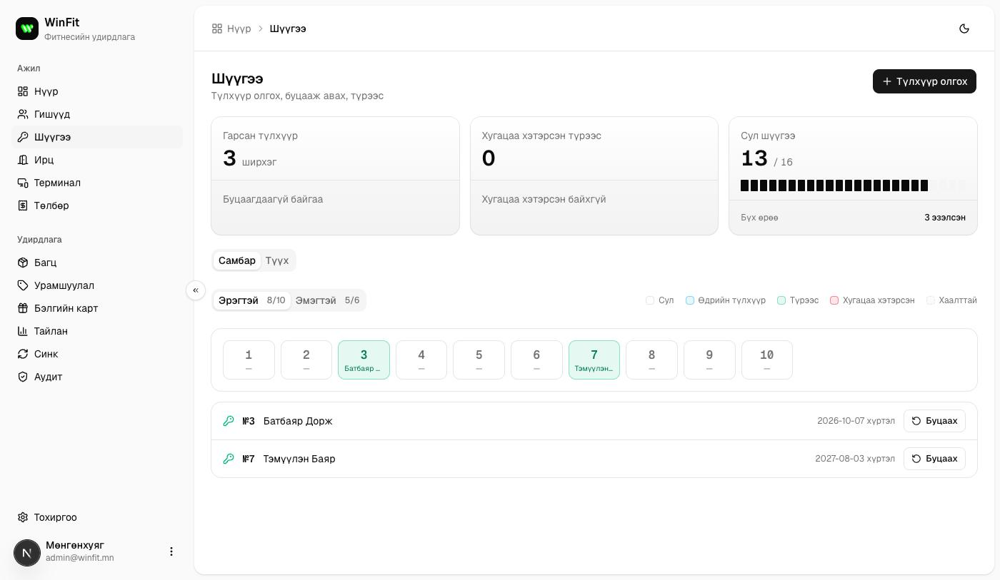

Хувцас солих өрөөний түлхүүрийн бүртгэл.

**Дээд талын 3 карт:** гарсан түлхүүр · хугацаа хэтэрсэн түрээс · сул шүүгээ.

**Хоёр хавтас:**

* **Самбар** — одоогийн байдал.
* **Түүх** — өмнөх олголт, буцаалт.

**Самбар дээр:**

* Өрөөгөөр шүүнэ: `Эрэгтэй 8/10` · `Эмэгтэй 5/6`.
* Дөрвөлжин бүр = нэг шүүгээ. Өнгө:

| Өнгө | Утга |
|---|---|
| Цагаан | Сул |
| Цэнхэр | **Өдрийн түлхүүр** — явахдаа буцаана |
| Ногоон | **Түрээс** — сараар түрээсэлсэн |
| Улаан | **Хугацаа хэтэрсэн** түрээс |
| Саарал | Хаалттай (эвдэрсэн г.м.) |

* Доор нь **гарсан түлхүүрийн жагсаалт** — гишүүний нэр, хүртэл огноо,
  **«Буцаах»** товч.

### Түлхүүр олгох

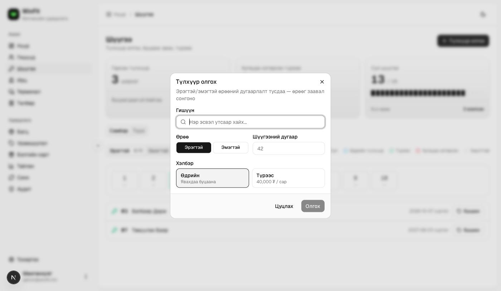

1. **Гишүүн** — нэр/утсаар хайна.
2. **Өрөө** — Эрэгтэй / Эмэгтэй. Гишүүний хүйсээр урьдчилан сонгогдоно.
3. **Шүүгээний дугаар** — сул дугаараас автоматаар санал болгоно, гараар
   өөрчилж болно.
4. **Хэлбэр:**
   * **Өдрийн** — явахдаа буцаана, төлбөргүй.
   * **Түрээс** — сараар. Үнэ нь тохиргооноос ирнэ (§5.6), гараар өөрчилж болно.
5. **«Олгох»**.

> **Эрэгтэй/эмэгтэй өрөөний дугаарлалт тусдаа** — Эрэгтэй №3 ба Эмэгтэй №3 нь
> өөр өөр шүүгээ.

---

## 4.7 Ирц

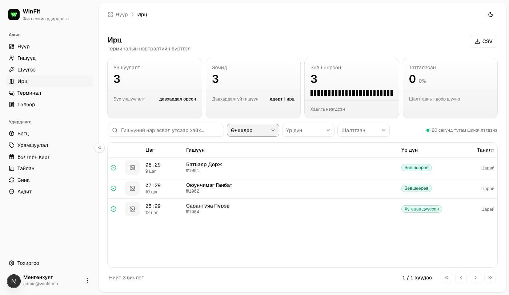

Терминалын нэвтрэлтийн бүх бүртгэл. **20 секунд тутам өөрөө шинэчлэгдэнэ.**

**4 карт:** уншуулалт · зочид (давхардалгүй) · зөвшөөрсөн · татгалзсан (%).

**Шүүлтүүр:** хайлт (нэр/утас) · хугацаа (Өнөөдөр г.м.) · үр дүн · шалтгаан.

**Хүснэгт:**

* **Зураг** — уншуулах агшны кадр. Дарвал томроно. Байхгүй бол саарал дүрс.
* **Цаг** — хэдэн цагт, хэдэн цагийн өмнө.
* **Гишүүн** — нэр, №. Бүртгэлгүй хүн бол «Танигдсангүй».
* **Үр дүн** — Зөвшөөрөв / Хугацаа дууссан / Түр зогссон / Танигдсангүй.
* **Танилт** — Царай / Карт / ПИН.

**CSV** товчоор тухайн шүүлтээр татаж Excel-д задлана.

> **Маргаан шийдэх:** «Би ороогүй» гэсэн маргаанд **кадрын зураг** шийдвэрлэх
> үүрэгтэй. Гэхдээ терминалын санах ой дүүрэхэд **хуучин зураг дарагддаг** тул
> хэдэн сарын өмнөх кадр олдохгүй байж болно.

---

## 4.8 Терминал

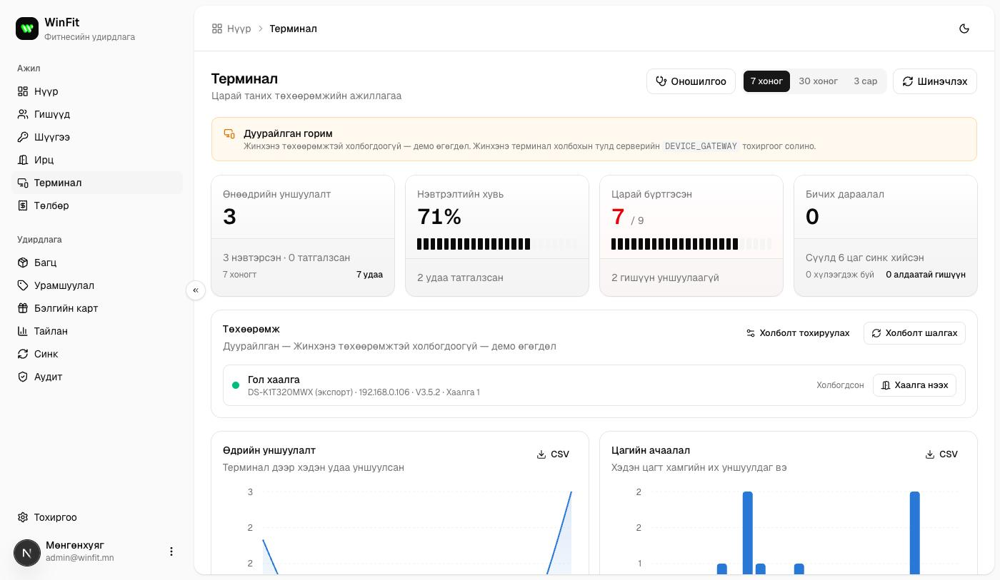

Царай таних төхөөрөмжийн ажиллагаа.

**Дээд талд:** `Оношилгоо` · хугацаа (7 хоног / 30 хоног / 3 сар) · `Шинэчлэх`.

> **Шар анхааруулга «Дуурайлган горим»** гарвал систем жинхэнэ терминалтай
> холбогдоогүй, **демо өгөгдөл** үзүүлж байна гэсэн үг. Жинхэнэ холболтыг
> админ серверийн тохиргооноос (`DEVICE_GATEWAY`) идэвхжүүлнэ.

**4 карт:**

| Карт | Утга |
|---|---|
| **Өнөөдрийн уншуулалт** | Нийт оролдлого, зөвшөөрөгдсөн, татгалзсан |
| **Нэвтрэлтийн хувь** | Амжилттай уншуулалтын хувь. **Буурвал** камерын цэвэрлэгээ, гэрэлтүүлгийг шалгана |
| **Царай бүртгэгдсэн** | Хэдэн гишүүн уншуулсан / нийт. Улаан тоо = хоцорсон |
| **Бичих дараалал** | Терминал руу явахаар хүлээгдэж буй өөрчлөлт. **0 байх ёстой** |

**Төхөөрөмжийн хэсэг:** модель, IP, firmware, хаалганы нэр, холболтын төлөв.

| Товч | Юу хийх вэ |
|---|---|
| **Холболт тохируулах** | IP, хэрэглэгч, нууц үг (админ) |
| **Холболт шалгах** | Одоо хүрч байгаа эсэхийг шалгана |
| **Хаалга нээх** | **Алсаас хаалга нээнэ.** Гишүүн картаа мартсан, терминал уншихгүй байгаа үед. Аудитад бичигдэнэ |

**Графикууд:** өдрийн уншуулалт · цагийн ачаалал (аль цагт хамгийн их ирдэг —
ажиллах хуваарь төлөвлөхөд). Хоёуланг нь CSV-ээр татна.

### Оношилгоо

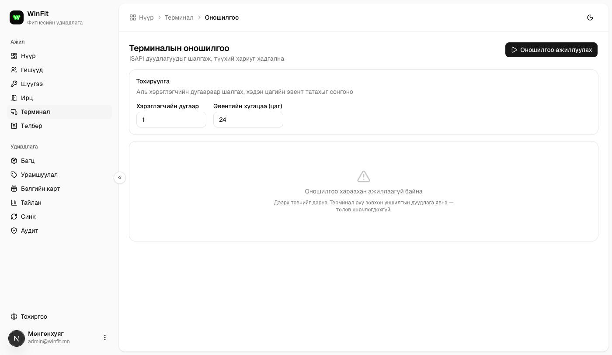

`Терминал → Оношилгоо`. Холболтын асуудал гарсан үед ашиглана.

1. **Хэрэглэгчийн дугаар** — шалгах гишүүний №.
2. **Эвентийн хугацаа (цаг)** — хэдэн цагийн эвент татахыг сонгоно.
3. **«Оношилгоо ажиллуулах»** — ISAPI дуудлага бүрийг гүйцэтгэж хариуг харуулна.

> **Аюулгүй:** оношилгоо нь зөвхөн **уншина**. Терминал дээрх ямар ч төлөв
> өөрчлөгдөхгүй.

---

## 4.9 Төлбөр

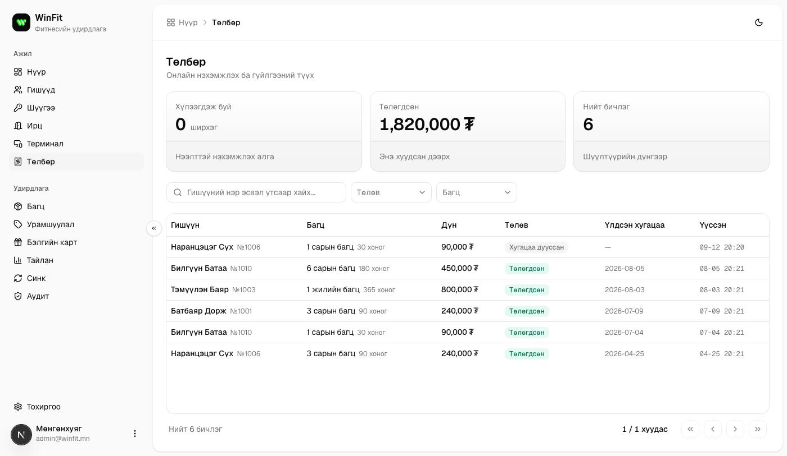

Онлайн нэхэмжлэх ба гүйлгээний түүх.

**3 карт:** хүлээгдэж буй · төлөгдсөн (дүн) · нийт бичлэг.

**Шүүлтүүр:** хайлт · төлөв · багц.

**Хүснэгт:** гишүүн (нэр + №) · багц (хоног) · дүн · төлөв · үлдсэн хугацаа ·
үүссэн огноо.

| Төлөв | Утга |
|---|---|
| **Төлөгдсөн** | Банкнаас баталгаа ирсэн, эрх сунгагдсан |
| **Хүлээгдэж буй** | Үүссэн ч төлөгдөөгүй |
| **Хугацаа дууссан** | Хүлээх хугацаа өнгөрч автоматаар хаагдсан |

> Энэ хуудас нь **онлайн** төлбөрийг харуулна. Ресепшн дээр бэлнээр авсан
> төлбөр нь гишүүний **«Худалдан авалт»** хавтаст болон Тайланд орно.

---

## 4.10 Багц

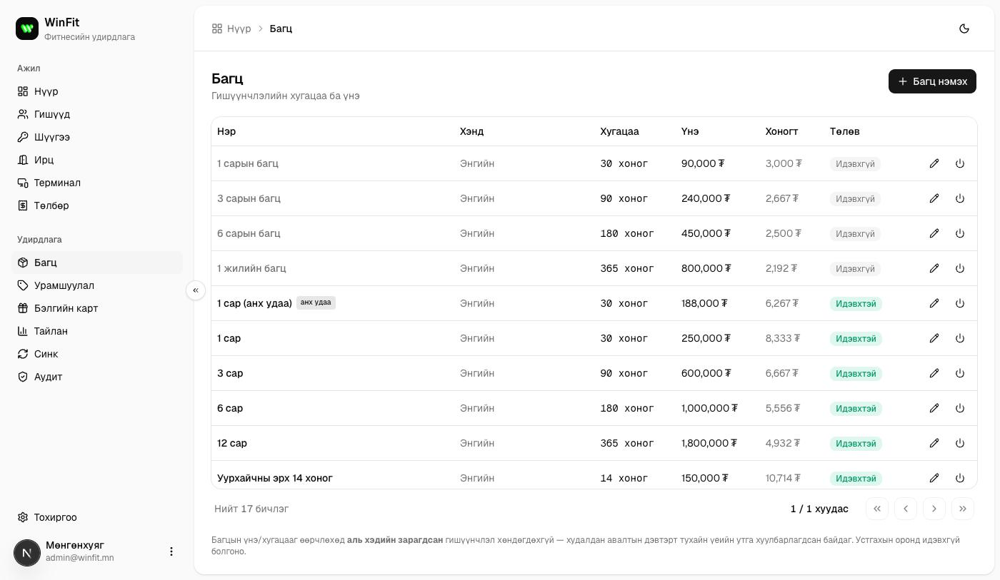

Гишүүнчлэлийн хугацаа ба үнийн жагсаалт.

**Баганууд:** нэр · хэнд (Энгийн/Оюутан г.м.) · хугацаа · үнэ · **хоногт**
(нэгж үнэ, харьцуулахад тустай) · төлөв.

**Мөр бүрийн товч:** ✏️ засах · ⏻ идэвхтэй/идэвхгүй болгох.

> **⚠️ Багцын үнэ/хугацааг өөрчлөхөд аль хэдийн зарагдсан гишүүнчлэл
> хөндөгдөхгүй.** Худалдан авалтын дэвтэрт тухайн үеийн утга хуулбарлагдсан
> байдаг. Иймд хуучин гишүүдийн эрх хэвээр үлдэнэ.
>
> **Багцыг устгах боломжгүй** — зөвхөн **идэвхгүй** болгоно. Идэвхгүй багц
> шинээр зарагдахгүй ч түүхэнд хэвээр харагдана.

**«анх удаа» шошго:** зөвхөн **шинэ гишүүнд** нэг удаа зарагдах багц.

---

## 4.11 Урамшуулал

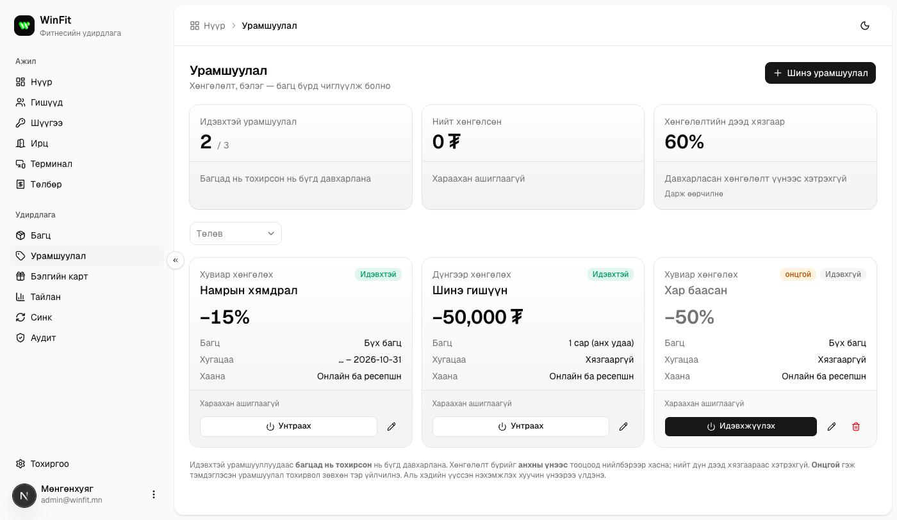

Хөнгөлөлт, урамшууллын удирдлага. **Зөвхөн админ.**

**3 карт:** идэвхтэй урамшууллын тоо · нийт хөнгөлсөн дүн · хөнгөлөлтийн дээд
хязгаар (%).

**Карт бүр дээр:**

| Мөр | Утга |
|---|---|
| Төрөл | **Хувиар хөнгөлөх** · **Дүнгээр хөнгөлөх** · **Тогтмол үнэ** |
| Хэмжээ | `−15%` эсвэл `−50,000₮` |
| **Багц** | Аль багцад нөлөөлөх. «Бүх багц» эсвэл сонгосон багцууд |
| **Хугацаа** | Эхлэх–дуусах огноо. «Хязгааргүй» бол дуусахгүй |
| **Хаана** | Онлайн ба ресепшн · зөвхөн онлайн · зөвхөн ресепшн |
| Ашиглалт | Хэдэн удаа хэрэглэгдсэн |

**Товчнууд:** `Унтраах` / `Идэвхжүүлэх` · ✏️ засах · 🗑 устгах
(**зөвхөн хэрэглэгдээгүй** урамшуулал устана).

### Хөнгөлөлт хэрхэн тооцогддог вэ

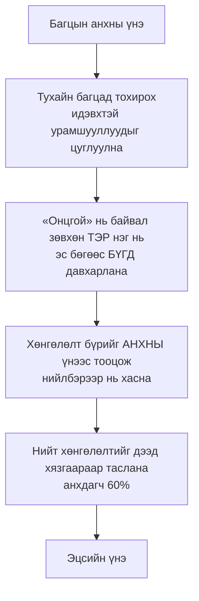
```mermaid
flowchart TD
    A["Багцын анхны үнэ"] --> B["Тухайн багцад тохирох<br/>идэвхтэй урамшууллуудыг цуглуулна"]
    B --> C["«Онцгой» нь байвал зөвхөн ТЭР нэг нь<br/>эс бөгөөс БҮГД давхарлана"]
    C --> D["Хөнгөлөлт бүрийг АНХНЫ үнээс тооцож<br/>нийлбэрээр нь хасна"]
    D --> E["Нийт хөнгөлөлтийг дээд хязгаараар таслана<br/>анхдагч 60%"]
    E --> F["Эцсийн үнэ"]
```

**Жишээ:** 250,000₮ багц дээр «Намрын хямдрал −15%» ба «Шинэ гишүүн −50,000₮»
хоёулаа тохирвол:

```
250,000 − (250,000 × 15%) − 50,000 = 250,000 − 37,500 − 50,000 = 162,500₮
```

* **«Онцгой»** гэж тэмдэглэсэн урамшуулал (жишээ нь «Хар баасан −50%») тохирвол
  **зөвхөн тэр нэг нь** үйлчилнэ — бусад нь хасагдана.
* **Тогтмол үнэ** төрлийн урамшуулал үргэлж онцгой байна.
* Нийт хөнгөлөлт **дээд хязгаараас** (анхдагч **60%**) хэтэрвэл таслагдана.
  Энэ нь буруу тохиргооноос болж багц үнэгүй болохоос сэргийлнэ.

---

## 4.12 Бэлгийн карт

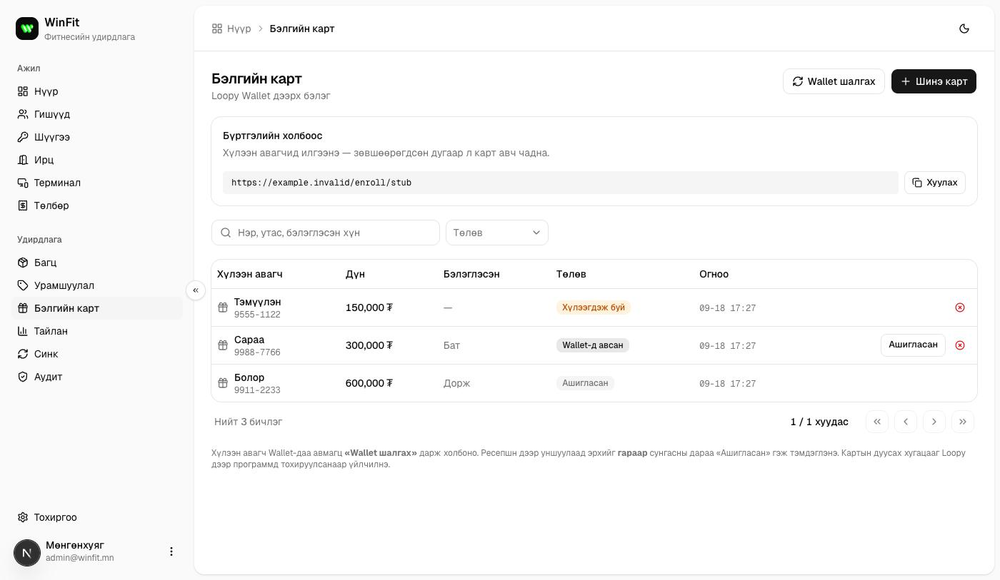

Loopy Wallet дээрх бэлгийн карт.

**Дээд талын хайрцаг:** **бүртгэлийн холбоос**. Хүлээн авагчид илгээнэ.
«Хуулах» дарж мессежээр явуулна.

> **Зөвхөн зөвшөөрөгдсөн дугаар** карт авч чадна. Холбоос задарсан ч өөр
> дугаартай хүн авахгүй.

**Хүснэгт:** хүлээн авагч (нэр + утас) · дүн · бэлэглэсэн хүн · төлөв · огноо.

| Төлөв | Утга | Дараагийн алхам |
|---|---|---|
| **Хүлээгдэж буй** | Карт үүссэн, Wallet-д аваагүй | Холбоосыг дахин илгээнэ |
| **Wallet-д авсан** | Утсандаа нэмсэн | Ресепшн дээр уншуулахыг хүлээнэ |
| **Ашигласан** | Эрх болгон хөрвүүлсэн | Дууссан |

**Товчнууд:** `Ашигласан` (тэмдэглэх) · ⊗ (цуцлах) · **«Wallet шалгах»**
(хэн авсныг Loopy-оос татаж шинэчлэх).

### Шинэ карт үүсгэх

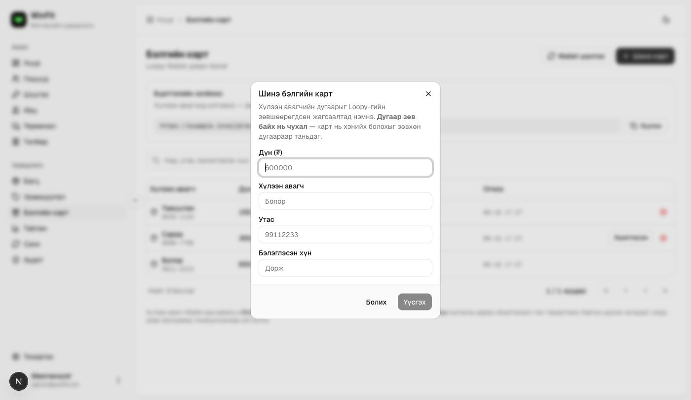

| Талбар | Тайлбар |
|---|---|
| **Дүн** | Бэлгийн дүн ₮ |
| **Хүлээн авагч** | Нэр |
| **Утас** | ⚠️ **Зөв байх нь чухал** — карт нь зөвхөн энэ дугаараар танигдана |
| **Бэлэглэсэн хүн** | Хэн бэлэглэсэн (картан дээр харагдана) |

### Бэлгийн картын урсгал

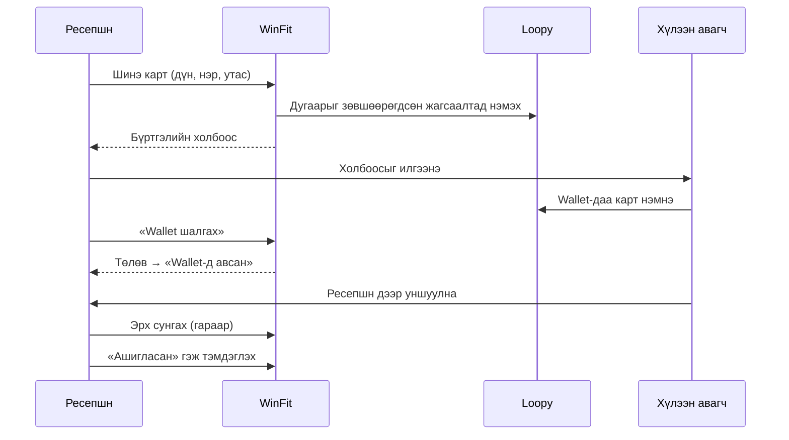
```mermaid
sequenceDiagram
    participant R as Ресепшн
    participant W as WinFit
    participant L as Loopy
    participant G as Хүлээн авагч
    R->>W: Шинэ карт (дүн, нэр, утас)
    W->>L: Дугаарыг зөвшөөрөгдсөн жагсаалтад нэмэх
    W-->>R: Бүртгэлийн холбоос
    R->>G: Холбоосыг илгээнэ
    G->>L: Wallet-даа карт нэмнэ
    R->>W: «Wallet шалгах»
    W-->>R: Төлөв → «Wallet-д авсан»
    G->>R: Ресепшн дээр уншуулна
    R->>W: Эрх сунгах (гараар)
    R->>W: «Ашигласан» гэж тэмдэглэх
```

> ⚠️ **Бэлгийн карт эрхийг автоматаар сунгадаггүй.** Ресепшн уншуулаад
> **гараар** эрх сунгаж, дараа нь «Ашигласан» гэж тэмдэглэнэ. Энэ хоёр алхмыг
> мартвал карт дахин ашиглагдаж болзошгүй.

> **Бэлгийн карт өөрийн гэсэн тусдаа Loopy программ шаарддаг**
> (§5.9). Гишүүнчлэлийн программтай нэг байж болохгүй — талбар, дизайн нь
> өөр.

---

## 4.13 Тайлан

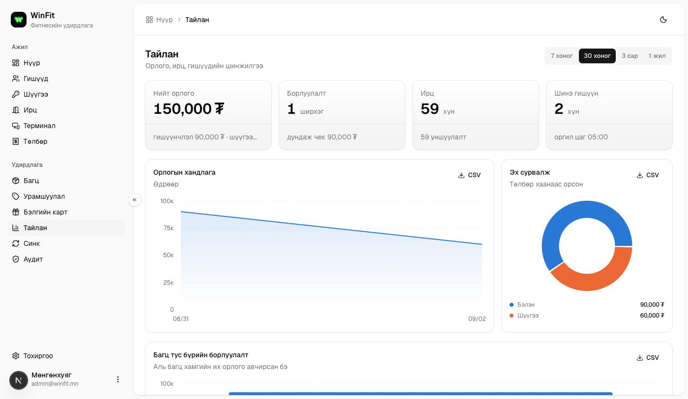

Орлого, ирц, гишүүдийн шинжилгээ.

**Хугацаа:** `7 хоног` · `30 хоног` · `3 сар` · `1 жил`.

**4 карт:** нийт орлого (эх сурвалжаар задарсан) · борлуулалтын тоо (дундаж
чек) · ирц · шинэ гишүүн (оргил цаг).

**Графикууд** (бүгд **CSV**-ээр татагдана):

| График | Юу хэлэх вэ |
|---|---|
| **Орлогын хандлага** | Өдрөөр. Уналт эрт мэдэгдэнэ |
| **Эх сурвалж** (тойрог) | Бэлэн · Онлайн · Шүүгээ · Бэлэг |
| **Багц тус бүрийн борлуулалт** | Аль багц орлого авчирдаг вэ — үнийн бодлогод |

---

## 4.14 Синк

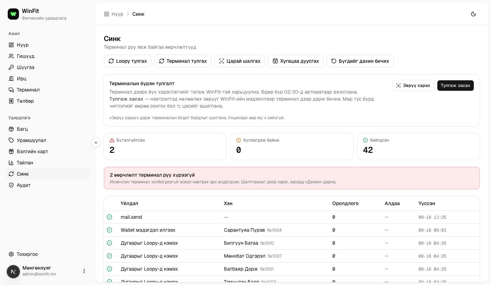

Терминал ба Loopy руу явж байгаа өөрчлөлтүүд. **Асуудал гарвал эхлээд энд
хараарай.**

**Дээд талын товчнууд:**

| Товч | Юу хийх вэ |
|---|---|
| **Loopy тулгах** | Wallet карт, зөвшөөрөгдсөн дугаарыг тулгана |
| **Терминал тулгах** | Терминал дээрх хэрэглэгчдийг WinFit-тэй харьцуулна |
| **Царай шалгах** | Царай бүртгэгдсэн эсэхийг шууд шалгана |
| **Хугацаа дуусгах** | Хугацаа хэтэрсэн эрхүүдийг шууд боловсруулна |
| **Бүгдийг дахин бичих** | ⚠️ Бүх гишүүнийг терминал руу дахин бичнэ. Удаан, зөвхөн онцгой үед |

**«Терминалын бүрэн тулгалт» хэсэг:** өдөр бүр **02:30**-д автоматаар
ажиллана.

* **«Зөрүү харах»** — терминалын бодит байдлыг **уншина** (юу ч өөрчлөхгүй).
* **«Тулгаж засах»** — илэрсэн зөрүүг терминал дээр **бичнэ**. Мөр тус бүрд
  чиглэл сонгох бол ⇄ цэсийг ашиглана.

**3 карт:** бүтэлгүйтсэн · хүлээгдэж байна · хийгдсэн.

**Улаан анхааруулга** гарвал (жишээ нь «2 өөрчлөлт терминал руу хүрээгүй»):

1. Шалтгааныг доорх хүснэгтээс уншина (ихэвчлэн: терминал холбогдоогүй,
   нэвтрэх эрх алдагдсан).
2. Асуудлыг засна (сүлжээ, IP, нууц үг).
3. **«Дахин»** дарна.

**Хүснэгт:** үйлдэл (`terminal.upsert`, `Дугаарыг Loopy-д нэмэх`,
`Wallet мэдэгдэл илгээх`, `mail.send`) · хэн · оролдлого · алдаа · үүссэн цаг.

> **Дахин оролдлогын хуваарь:** 1 мин → 5 мин → 30 мин → 2 цаг → 6 цаг.
> 5 удаа бүтэлгүйтвэл зогсоож, улаанаар тэмдэглэнэ.

---

## 4.15 Аудит

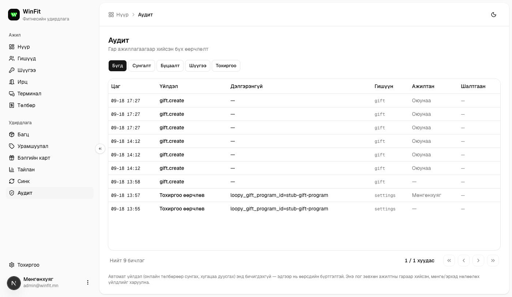

**Гар ажиллагаагаар** хийсэн бүх өөрчлөлт.

**Шүүлтүүр:** Бүгд · Сунгалт · Буцаалт · Шүүгээ · Тохиргоо.

**Баганууд:** цаг · үйлдэл · дэлгэрэнгүй · гишүүн · **ажилтан** · шалтгаан.

> **Аудитад юу ОРОХГҮЙ вэ:** автомат үйлдэл (онлайн төлбөрөөр сунгасан,
> хугацаа дуусгасан) энд **бичигдэхгүй** — эдгээр нь өөрсдийн бүртгэлтэй.
> Аудит нь зөвхөн **хүн гараар** хийсэн, мөнгө/эрхэд нөлөөлөх үйлдлийг
> харуулна.

**Хэрэглээ:** маргаан шийдэх, хэн хөнгөлөлт өгснийг тогтоох, буруу сунгалтыг
олох.

---

# 5. Тохиргоо

`Тохиргоо` цэс нь хоёр бүлэгтэй: **Хувийн** (өөрийн бүртгэл) ба
**Байгууллага** (зөвхөн админ).

## 5.1 Профайл

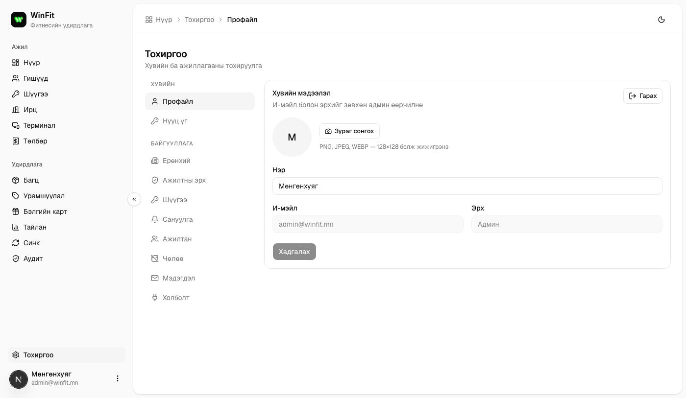

* **Зураг** — PNG/JPEG/WEBP, 128×128 болж жижигрэнэ.
* **Нэр** — өөрөө өөрчилнө.
* **И-мэйл** ба **Эрх** — **зөвхөн админ** өөрчилнө (тул энд түгжээтэй).
* **«Гарах»** — системээс гарна.

## 5.2 Нууц үг

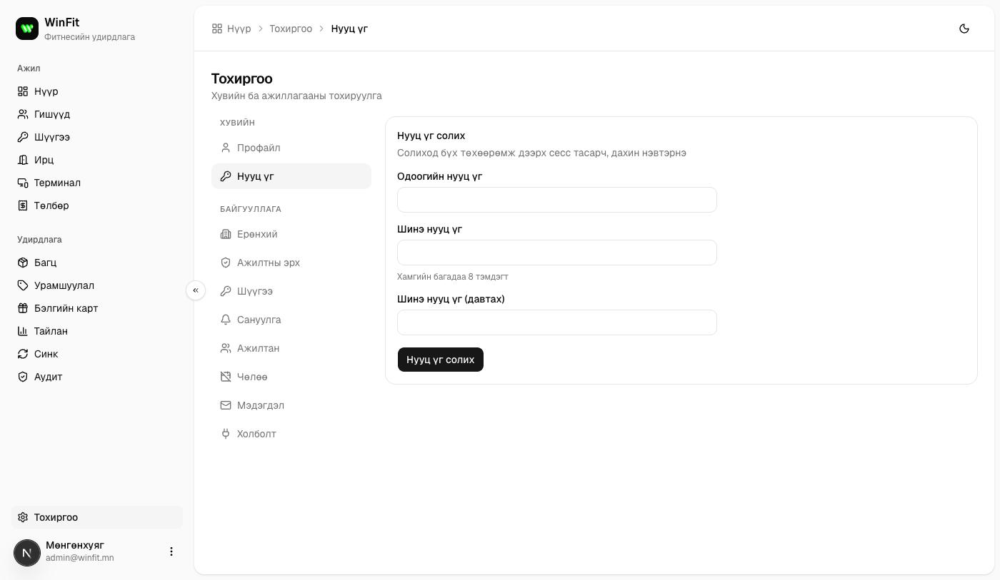

Одоогийн нууц үг + шинэ нууц үг (хамгийн багадаа **8 тэмдэгт**) + давтах.

> ⚠️ **Нууц үг солиход бүх төхөөрөмж дээрх сесс тасарна** — утас, өөр компьютер
> дээр дахин нэвтэрнэ.

## 5.3 Ажилтны эрх

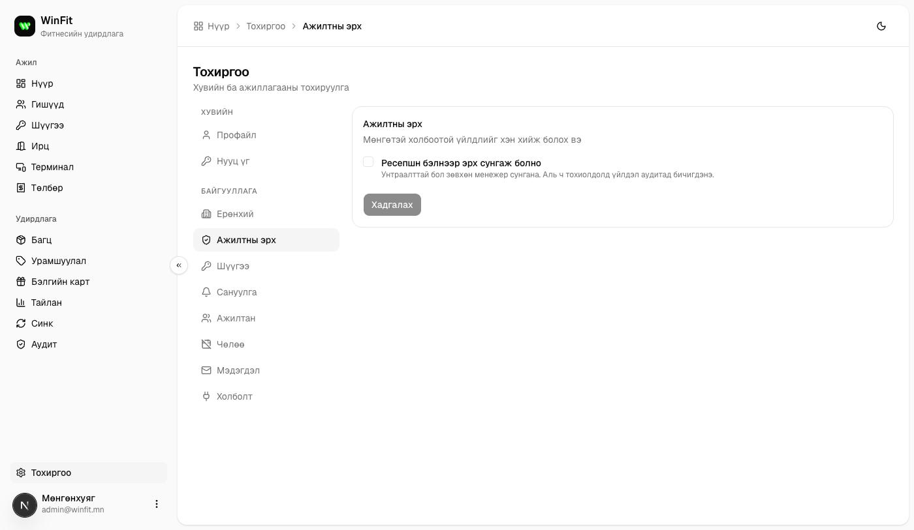

Ганц тохируулга:

**«Ресепшн бэлнээр эрх сунгаж болно»**

| Төлөв | Утга |
|---|---|
| **Унтраалттай** (анхдагч) | Зөвхөн **менежер ба админ** бэлнээр эрх сунгана |
| **Асаалттай** | Ресепшн ажилтан ч бэлнээр сунгаж чадна |

> Аль ч тохиолдолд **үйлдэл Аудитад бичигдэнэ**. Энэ тохируулга нь хяналтыг
> хатуу эсвэл зөөлөн болгох сонголт — жижиг заал дээр асаах нь ажлыг
> хурдасгана, олон ажилтантай заал дээр унтраах нь хяналтыг сайжруулна.

## 5.4 Ерөнхий

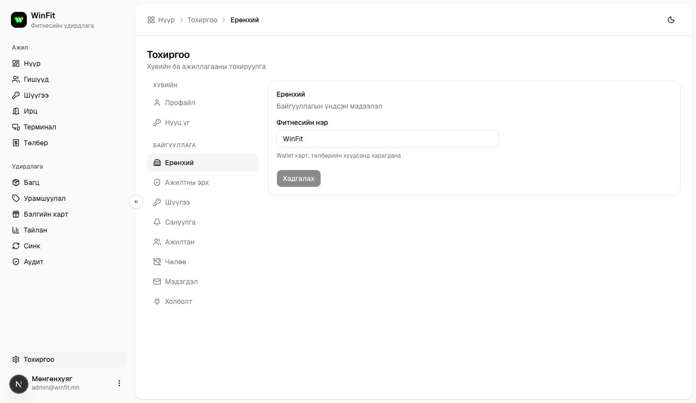

**Фитнесийн нэр** — Wallet карт ба төлбөрийн хуудсанд харагдана. Өөрчлөхөд
шинээр үүсэх картууд дээр шууд нөлөөлнө.

## 5.5 Ажилтан

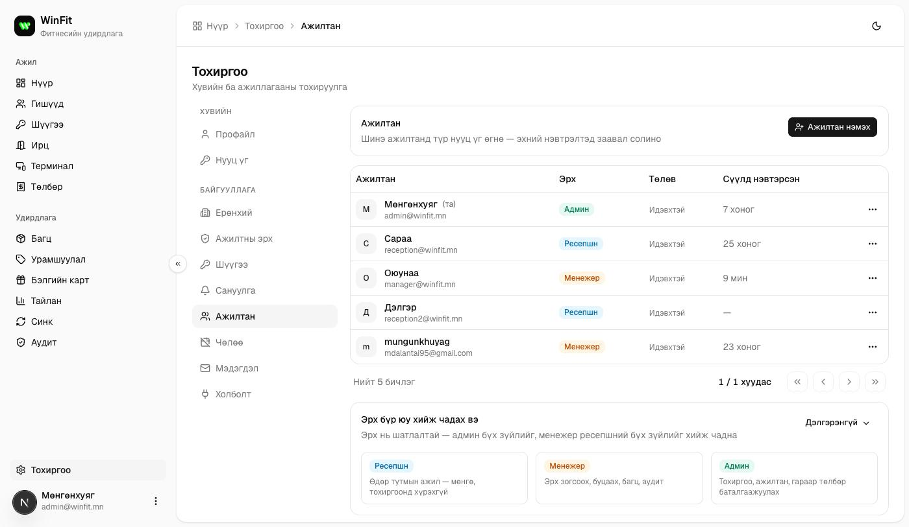

Системд нэвтрэх эрхтэй хүмүүсийн жагсаалт.

**Баганууд:** нэр + и-мэйл · эрх · төлөв · сүүлд нэвтэрсэн.

Доор нь **«Эрх бүр юу хийж чадах вэ»** гэсэн товч тайлбар байна.

### Шинэ ажилтан нэмэх

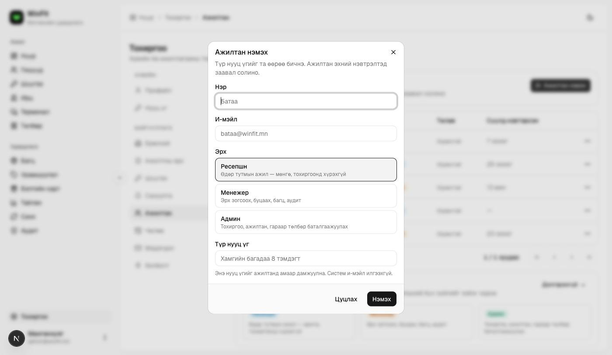

| Талбар | Тайлбар |
|---|---|
| **Нэр** | Ажилтны нэр |
| **И-мэйл** | Нэвтрэх хаяг. Давхардаж болохгүй |
| **Эрх** | Ресепшн · Менежер · Админ |
| **Түр нууц үг** | Хамгийн багадаа 8 тэмдэгт. **Та өөрөө бичнэ** |

> ⚠️ **Систем и-мэйл илгээхгүй.** Түр нууц үгийг ажилтанд **амаар эсвэл
> найдвартай сувгаар** дамжуулна. Ажилтан эхний нэвтрэлтэд заавал солино.

### Эрх солих, идэвхгүй болгох

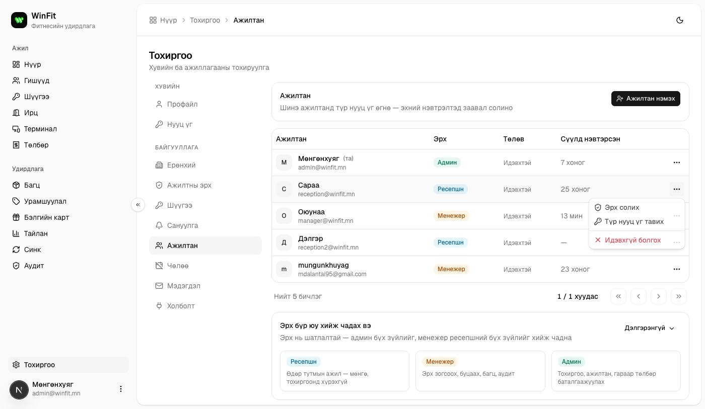

Мөрийн төгсгөлд байгаа **«···»** дарна:

| Сонголт | Юу болох вэ |
|---|---|
| **Эрх солих** | Ресепшн ⇄ Менежер ⇄ Админ. **Шууд хүчинтэй** болно |
| **Түр нууц үг тавих** | Нууц үгээ мартсан ажилтанд шинэ түр нууц үг өгнө. Ажилтан дараагийн нэвтрэлтэд солино |
| **Идэвхгүй болгох** | Нэвтрэх эрхийг хаана |

> **Ажилтныг устгадаггүй — зөвхөн идэвхгүй болгоно.** Учир нь Аудит дээрх
> бичлэгүүд «хэн хийсэн» гэдгээ алдах болно. Идэвхгүй ажилтан нэвтэрч чадахгүй
> ч түүхэнд нэр нь хэвээр үлдэнэ. Дахин ажилд орвол эргүүлж идэвхжүүлнэ.

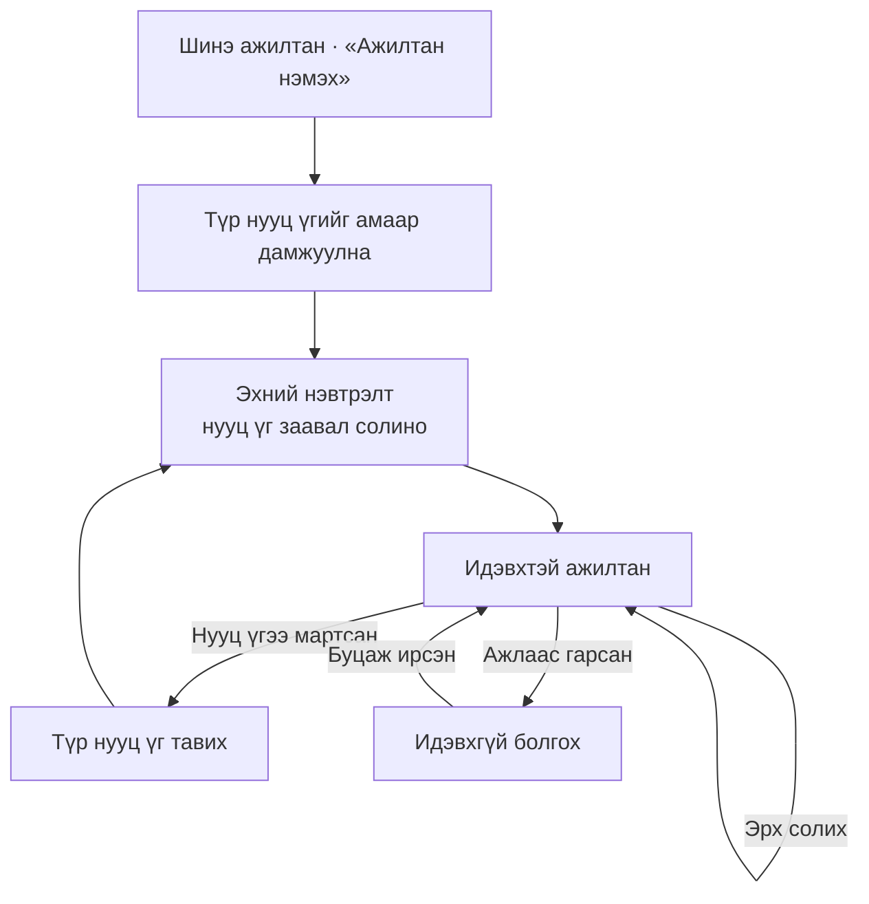
```mermaid
flowchart TD
    A["Шинэ ажилтан · «Ажилтан нэмэх»"] --> B["Түр нууц үгийг амаар дамжуулна"]
    B --> C["Эхний нэвтрэлт<br/>нууц үг заавал солино"]
    C --> D["Идэвхтэй ажилтан"]
    D -->|"Эрх солих"| D
    D -->|"Нууц үгээ мартсан"| E["Түр нууц үг тавих"]
    E --> C
    D -->|"Ажлаас гарсан"| F["Идэвхгүй болгох"]
    F -->|"Буцаж ирсэн"| D
```

## 5.6 Шүүгээ

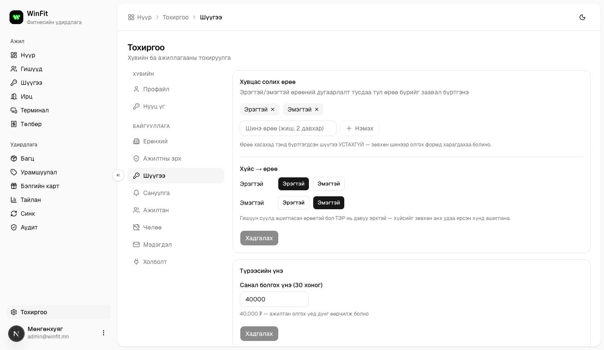

**Хувцас солих өрөө**

* Өрөөний нэрсийг нэмж, хасна (жишээ нь «Эрэгтэй», «Эмэгтэй»,
  «Жиш. 2 давхар»).
* ⚠️ **Өрөө хасахад тэнд бүртгэгдсэн шүүгээ УСТАХГҮЙ** — зөвхөн шинээр
  олгох формд харагдахаа болино.

**Хүйс → өрөө**

Аль хүйсийн хүнд аль өрөөг **урьдчилан сонгох** вэ. Энэ нь зөвхөн санал
болголт — ажилтан гараар өөрчилж болно.

> Гишүүн сүүлд ашигласан өрөөтэй бол **ТЭР нь давуу эрхтэй**. Хүйсийн
> тохируулга зөвхөн **анх удаа** ирсэн хүнд ашиглагдана.

**Түрээсийн үнэ**

30 хоногийн санал болгох үнэ. Түлхүүр олгох үед ажилтан өөрчилж болно.

## 5.7 Сануулга

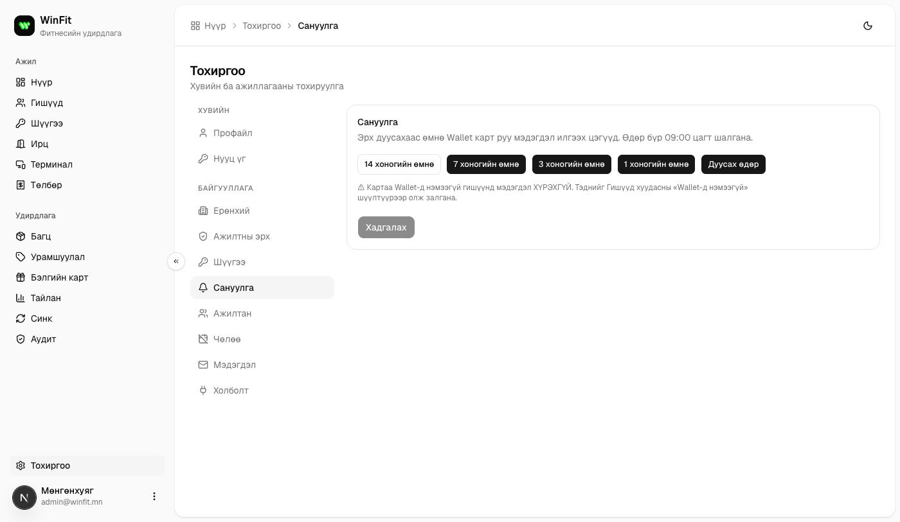

Эрх дуусахаас өмнө Wallet карт руу мэдэгдэл илгээх цэгүүд.

Сонголтууд: `14 хоногийн өмнө` · `7 хоногийн өмнө` · `3 хоногийн өмнө` ·
`1 хоногийн өмнө` · `Дуусах өдөр`. Хэдийг ч сонгож болно.

* Шалгалт **өдөр бүр 09:00** цагт ажиллана.
* ⚠️ **Wallet-д карт нэмээгүй гишүүнд мэдэгдэл ХҮРЭХГҮЙ.** Тэднийг
  `Гишүүд → Wallet карт → «Wallet-д нэмээгүй»` шүүлтүүрээр олж **гараар**
  залгана.

## 5.8 Чөлөө

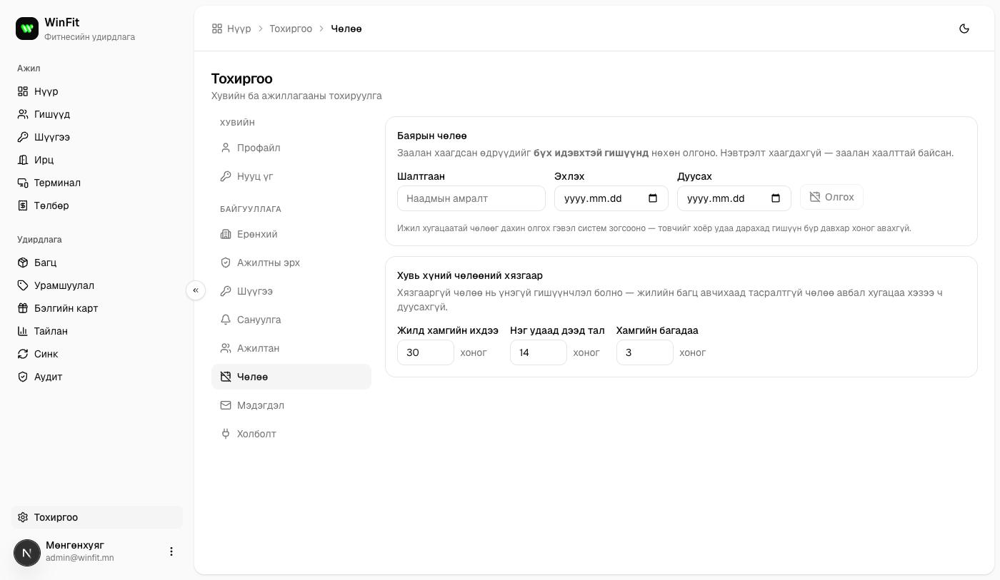

**Баярын чөлөө** — заалыг хаасан өдрүүдийг **бүх идэвхтэй гишүүнд** нөхөн
олгоно.

| Талбар | Тайлбар |
|---|---|
| **Шалтгаан** | «Наадмын амралт» г.м. Гишүүдийн түүхэнд харагдана |
| **Эхлэх / Дуусах** | Хаасан өдрүүд |

> ⚠️ **Ижил хугацаатай чөлөөг дахин олговол систем зогсооно** — товчийг хоёр
> удаа дарахад гишүүн бүр давхар хоног авахаас сэргийлнэ.

**Хувь хүний чөлөөний хязгаар**

| Тохируулга | Анхдагч | Утга |
|---|---|---|
| **Жилд хамгийн ихдээ** | 30 хоног | Нэг гишүүн жилд авах дээд хэмжээ |
| **Нэг удаад дээд тал** | 14 хоног | Нэг чөлөөний урт |
| **Хамгийн багадаа** | 3 хоног | Хэт богино чөлөө хориглоно |

> **Яагаад хязгаарлах вэ:** хязгааргүй чөлөө нь **үнэгүй гишүүнчлэл** болно —
> жилийн багц авчихаад тасралтгүй чөлөө авбал хугацаа нь хэзээ ч дуусахгүй.

## 5.9 Мэдэгдэл (мэйл)

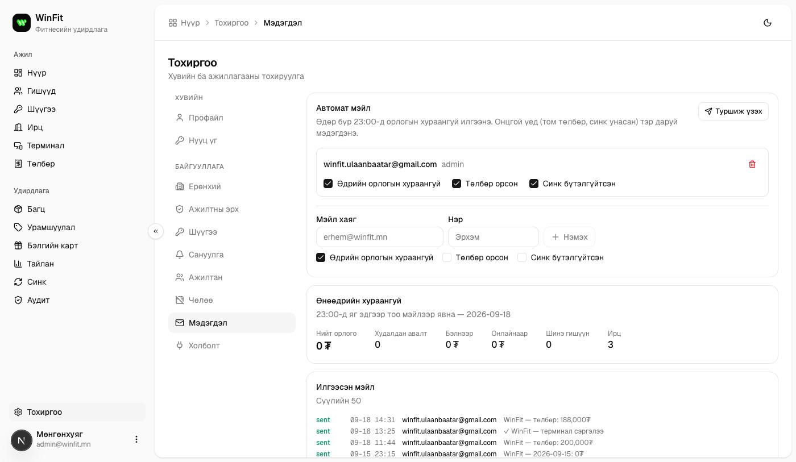

**Автомат мэйл** — өдөр бүр **23:00**-д орлогын хураангуй илгээнэ. Онцгой үед
(том төлбөр, синк унасан) тэр даруй мэдэгдэнэ.

Хүлээн авагч бүрд гурван сонголт:

| Сонголт | Хэзээ явах |
|---|---|
| **Өдрийн орлогын хураангуй** | Өдөр бүр 23:00 |
| **Төлбөр орсон** | Том төлбөр орох бүрд |
| **Синк бүтэлгүйтсэн** | Терминал/Loopy руу бичигдэхгүй болоход |

**«Турших»** товчоор мэйл ирж байгаа эсэхийг шалгана.

Доор нь **«Өнөөдрийн хураангуй»** (23:00-д яг явах тоо) ба **«Илгээсэн мэйл»**
(сүүлийн 50) харагдана.

## 5.10 Холболт

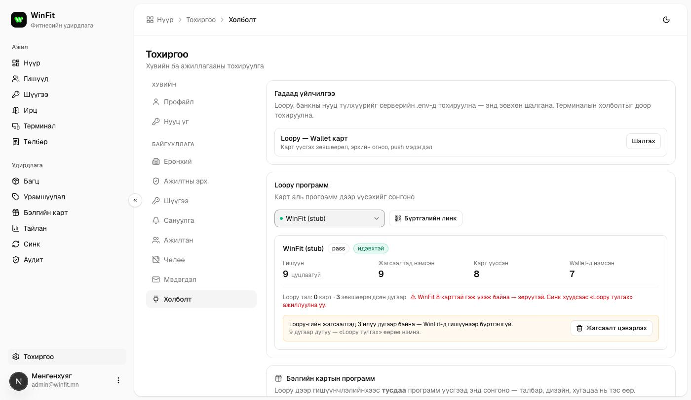

Гадаад үйлчилгээтэй холбогдох тохиргоо.

> 🔐 **Нууц түлхүүр энд харагдахгүй.** Loopy, банкны түлхүүрийг серверийн
> `.env` файлд тохируулна. Энэ хуудас зөвхөн **холболт ажиллаж байгаа эсэхийг
> шалгана**.

**Loopy — Wallet карт:** «Шалгах» дарж холболтыг шалгана.

**Loopy программ:** карт аль программ дээр үүсэхийг сонгоно. Доор нь статистик:

| Үзүүлэлт | Утга |
|---|---|
| **Гишүүн** | WinFit дээрх цуцлагдаагүй гишүүн |
| **Жагсаалтад нэмсэн** | Loopy-д зөвшөөрөгдсөн дугаар |
| **Карт үүссэн** | Бодитоор үүссэн карт |
| **Wallet-д нэмсэн** | Гишүүн утсандаа авсан |

⚠️ **Зөрүү илэрвэл** улаан бичвэр гарна («WinFit 8 карттай гэж үзэж байна —
зөрүүтэй»). Ийм үед **Синк → «Loopy тулгах»** ажиллуулна.

**«Жагсаалт цэвэрлэх»** — Loopy дээр илүү үлдсэн, WinFit-д байхгүй дугаарыг
устгана (гишүүн цуцлагдсан ч Loopy дээр үлдсэн үед).

**Бэлгийн картын программ** — гишүүнчлэлийнхээс **тусдаа** программ сонгоно.
Loopy дээр хоёр дахь программ үүсгээгүй бол энд анхааруулга гарна.

**«Бүртгэлийн линк»** — гишүүд Wallet карт авах ерөнхий холбоос.

---

# 6. Түгээмэл асуулт

**Шинэ гишүүн терминал дээр гарахгүй байна.**
Синк хуудсыг шалгана. Улаан бичлэг байвал терминалын холболт тасарсан. Засаад
«Дахин» дарна. Хүлээгдэж байгаа бол дээд тал нь 15 секунд хүлээнэ.

**Гишүүн царайгаа уншуулсан ч WinFit дээр «Бүртгүүлээгүй» гэж байна.**
30 секунд хүлээнэ. Хэвээр бол `Синк → «Царай шалгах»` дарна.

**Wallet карт ирэхгүй байна.**
Утасны дугаар зөв эсэхийг шалгана · `Тохиргоо → Холболт` дээр Loopy программ
сонгогдсон эсэхийг шалгана · `Синк → «Loopy тулгах»` ажиллуулна.

**Гишүүн эрх дуусах мэдэгдэл аваагүй гэж байна.**
Wallet-д карт нэмээгүй байх магадлалтай — сануулга зөвхөн Wallet руу явдаг.

**Буруу дүнгээр сунгачихлаа.**
Гишүүний дэлгэрэнгүй → **Худалдан авалт** хавтас → тухайн мөрийг **«Буцаах»**.
Мөр устахгүй, эрх нь дэвтрээс дахин тооцогдоно. Дараа нь зөв дүнгээр дахин
сунгана. (Менежер+)

**Ажилтан нууц үгээ мартсан.**
`Тохиргоо → Ажилтан → ··· → Түр нууц үг тавих`. Шинэ нууц үгийг амаар өгнө.

**Ирцийн зураг харагдахгүй байна.**
Хэвийн. Терминалын санах ой дүүрэхэд хуучин кадр дарагддаг. Мөн сервер
терминал руу хүрэхгүй үед ч харагдахгүй.

**«Дуурайлган горим» гэж юу вэ?**
Систем жинхэнэ терминалтай холбогдоогүй, демо өгөгдөл үзүүлж байна. Админ
серверийн `DEVICE_GATEWAY` тохиргоог өөрчилнө.

---

# 7. Хавсралт — гарын авлагыг шинэчлэх

```bash
cd dashboard/docs/admin-guide

# 1. Текстийг засна
$EDITOR README.md

# 2. Шинэ дэлгэцийн зураг нэмэх бол img/ дотор хийнэ
#    (нэр нь дарааллаараа: 32-xxx.jpg)

# 3. PDF дахин үүсгэнэ
./build.sh
```

Эсвэл `dashboard/` хавтаснаас:

```bash
npm run docs:pdf
```

**Шаардлага:** `pandoc` ба Google Chrome. Хоёулаа байхгүй бол
`build.sh` тодорхой алдаа өгнө.

Үр дүн: `dashboard/docs/admin-guide/admin-guide.pdf`

Диаграмууд нь Markdown дотор [Mermaid](https://mermaid.js.org/) хэлбэрээр
бичигдсэн тул GitHub дээр ч шууд зурагдана.
